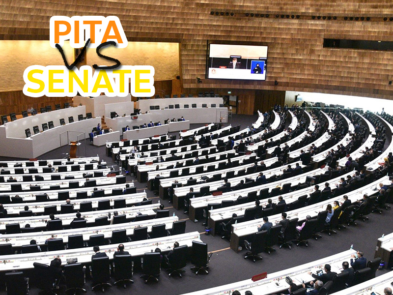

# Pita vs. Senate
Pita vs. Senate is an 2D-RPG game inspired by Thailand's political situation.

# Technical Specification
Using C++ with SFML Lib  
Visual Studio 2019 - Community Edition

# Disclaimer
This project is a part of an assignment from "Programming Fundamental" & "Programming Project", Bachelor of Computer Engineering, KMITL. 
Everything including images, musics, fonts do not belong to the developer. And they're used for educational purpose only, not for commercial. 
Any story or characters appeared in this game are not associated to any people in real world (even if the character is similar to any people in the real world). 
This game isn't intentionly created for political purpose.

# Developer
Mr.Paratpanu Pechsaman (66010542) Bechalor of Computer Engineering, KMITL.  
66010542@kmitl@ac.th
